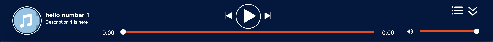
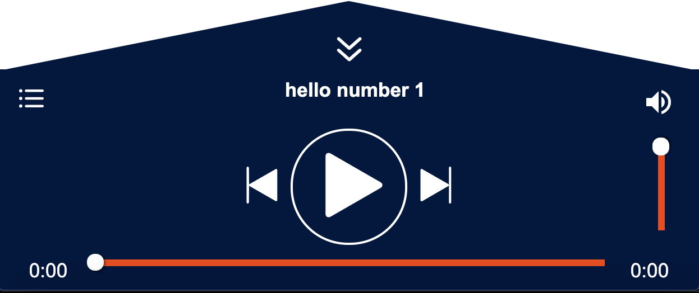
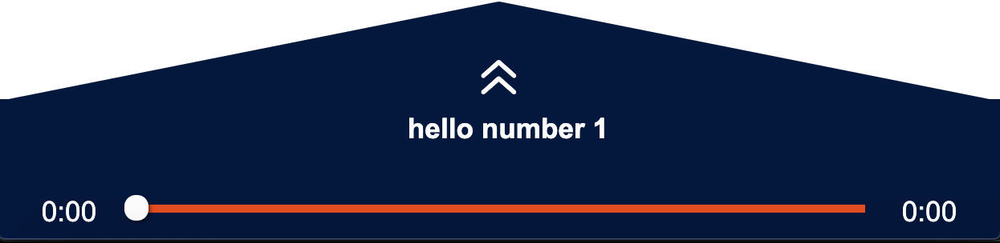

# React mp3 Player

An Mp3 player to play any audio file based on ReactJS

## Table of Contents

- [Installation](#installation)
- [Usage](#usage)
- [Screenshots](#screenshots)
- [Adding-new-icons-to-the-library](#Adding-new-icons-to-the-library)
- [Contributing](#contributing)

## Installation

Install via NPM

```shell
npm install react-mp3-player
```

or use yarn

```shell
yarn add react-mp3-player
```

## Usage

Import the Playlist component

```Javascript
import Playlist from 'react-mp3-player';
```

The tracks format will be ann array of objects, each object containing a name, description, src mp3 and an optional image

```Javascript
const tracks = [{ img: 'https://icon-library.net/images/music-icon-transparent/music-icon-transparent-11.jpg', name:'MP3', desc: 'Description 1', src:'Audio.mp3'},
{ img: 'https://icon-library.net/images/music-icon-transparent/music-icon-transparent-11.jpg', name:'MP3 #2', desc: 'Description 2', src:'Audio2.mp3'}]
```

Additional properties can be added to the component such as a right or left offset to decrease the width of the player as well as being able to choose the breakpoint for switching to mobile view, these options are passed into the playlist component in an object as props.

```Javascript
const playlistOverideStylingOpts = {
  offset : {
    left : 300
  },
  breakpoint : {
    maxWidth : 768
    }
};
```

Add the Player component and pass it the relative mp3 tracks as well as any addition style options as opts

```Javascript
<Playlist tracks={tracks} opts={playlistOverideStylingOpts}/>
```

## Screenshots

_Desktop_


_Desktop Hidden_


_Mobile_


_Mobile Hidden_


## Adding new features to the mp3

Make any changes or additional features in the Player.js component and update the version (in the package.json) by 0.0.1 and then push all your changes to the repo.

### Publish to NPM

Firstly make sure to build to the dist folder. Run

```shell
yarn build
```

Then publish the update to npm by running

```shell
npm publish
```

Your update should now be live on NPM. Make sure to update the package in your project by running

```shell
yarn upgrade react-mp3-player
```

### Contributors

Liam Riley - github.com/Liamriley123
Dannish Hussain - github.com/Dannish94
Austin Kershaw - github.com/austinmkershaw
